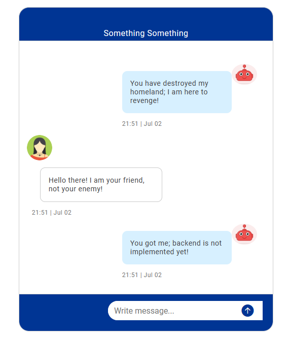

# Simple Chatbox UI
This is part of a project that we intended to build as a demo, aiming to showcase a possibility to combine 
optimization and LLM to improve customer's experience.

The overall flow is
1. Get user input and extract information
2. Keep prompting for additional information if needed
3. Run backend algorithms
4. Return response to the user

## Mock-up UI
